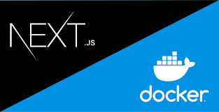

<div align="center">

</div>

<h1 align="center">docker-nextjs-application</h1>
<p align=center><i align="center">Aplicação modelo em Node/Next.js para implantação como container Docker</i></p>
<br>

<div align="center">

<a href="https://nextjs.org"></a>
<a href="https://www.docker.com"></a>
<a href="https://reactjs.org"></a>

<a href=""></a>
<a href=""></a>
<a href=""></a>

<a href=""></a>
<a href=""></a>
<a href=""></a>

<a href=""></a>
<a href=""></a>
<a href="https://github.com/dexdevlab/docker-nextjs-application/blob/main/LICENSE"></a>

|| [Conteúdo](#section-conteudo) || [Instruções](#section-instrucoes) || [Notas de versão](#section-changelog) ||

|| [Autores](#section-autores) || [Contato](#section-contato) || [Licença](#section-licenca) ||

</div>

<hr>

<a name="section-conteudo">

## Conteúdo

</a>

<br>

A fim de facilitar minhas implantações e testar meu ambiente de servidor caseiro o qual possui docker, resolvi criar esse repositório com uma API básica, cuja
única função é facilitar minha redistribuição e construção de imagens compatíveis com docker.

<hr>

<a name="section-caracteristicas">

## Características

</a>

<br>

- Fácil adaptação através dos arquivos auxiliares do Docker (.dockerignore, Dockerfile, docker-compose.yml)
- Permite a criação de imagem pelo Dockerfile e criação do stack pelo docker-compose

<hr>

<a name="section-stack">

## Stack

</a>

<br>

- **Linguagem Principal:** [Javascript](https://developer.mozilla.org/pt-BR/docs/Web/JavaScript)
- **Framework Principal:** [Node.js](https://nodejs.org/en/docs/)
- **Framework estrutural:** [Next.js](https://nextjs.org/docs/getting-started)
- **Gerenciador de Bibliotecas:** [Yarn](https://yarnpkg.com/getting-started)
- **Bibliotecas:** Para uma lista completa de bibliotecas e dependências nos mais variados escopos, conferir o arquivo [package.json](https://github.com/DexDevLab/docker-nextjs-application/blob/main/package.json).

<hr>

<a name="section-instrucoes">

## Instruções

</a>

<br>

### Utilizando como projeto

#### 1 - Realize um git clone deste repositório para seu repositório local

```bash
git clone https://github.com/DexDevLab/docker-nextjs-application
```

#### 2 - Instale o yarn, inicialize-o, e rode o projeto

```bash
npm install yarn -g
yarn
yarn dev
```

A aplicação estará executando normalmente em localhost:3000 como default.

**Lembre-se de executar `yarn build` ANTES de criar seu container com base no repositório local.**

<br>

### Criando o container a partir do repositório clonado

Para fazer o `docker compose` localmente, comente a linha 10 do [docker-compose.yml](https://github.com/DexDevLab/docker-nextjs-application/blob/main/docker-compose.yml):

`build: https://github.com/DexDevLab/docker-nextjs-application.git`

E descomente a linha 13:

`build: .`

Para apenas criar a imagem, utilize o `docker build` referenciando o arquivo local do [Dockerfile](https://github.com/DexDevLab/docker-nextjs-application/blob/main/Dockerfile):

```bash
docker build - < Dockerfile
```

<br>

### Utilizando como container Docker diretamente pelo repositório

Execute o comando:

```bash
docker run -p 5000:3000 -e github='https://github.com/DexDevLab/docker-nextjs-application.git' -it dexdevlab/docker-nextjs-application
```

A aplicação será instalada como um stack de container, com porta externa em 5000 e porta interna da aplicação como 3000, como default.

<br>

### Modificando portas do container

#### Alterando a porta interna da aplicação

##### 1 - Crie um arquivo `.env` dentro da raiz do repositório local que contenha a seguinte informação

`PORT=1111`

E informe a porta desejada (1111 para exemplo).

##### 2 - Altere a linha 7 do `docker-compose.yml`

```bash
ports:
            - "5000:1111"
```

E informe a mesma porta do passo anterior.

##### 3 - Altere a linha 7 do `Dockerfile`

```bash
EXPOSE 1111
```

E informe a mesma porta do passo anterior.

<br>

#### Alterando a porta externa

Altere a linha 7 do `docker-compose.yml`:

```bash
ports:
            - "8080:3000"
```

E informe a porta desejada (8080 para exemplo).

<hr>

## Como a aplicação funciona

### Teste método **GET**

Acesse o navegador com o endereço localhost:3000/api/test (sendo 3000 a porta default), e receberá o seguinte resultado:


### Teste método **POST**

Utilize sua ferramenta de teste de API favorita para enviar uma requisição POST para o endereço localhost:3000/api/test, do tipo objeto `data` em formato JSON:

```json
{
  data: "teste01"
}
```

Se tudo correu bem, receberá uma resposta como essa:


<hr>

<a name="section-changelog">

## Notas de versão

</a>

<br>

### v1.0.0-240307

- Commit inicial

<hr>

<a name="section-autores">

## Autores

</a>

<br>

<a href="https://github.com/DexDevLab/docker-nextjs-application/graphs/contributors">
  
</a>

<hr>

<a name="section-contato">

## Contato

</a>

<br>

Se você gostou desse projeto, me dê uma <a href="https://github.com/DexDevLab/docker-nextjs-application" data-icon="octicon-star" aria-label="Star DexDevLab/docker-nextjs-application on GitHub">estrela</a>.
<br>
Para contato, envie um email a: <a href="mailto:dex.houshi@hotmail.com">dex.houshi@hotmail.com</a>

<hr>

<a name="section-licenca">

## Licença

</a>

Licenciado sob a [MIT License](https://github.com/DexDevLab/docker-nextjs-application/blob/main/LICENSE).
